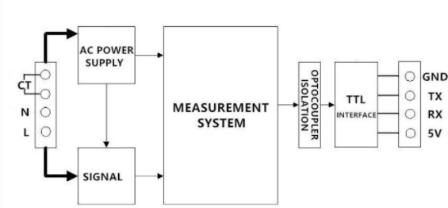
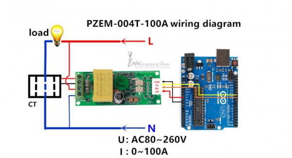
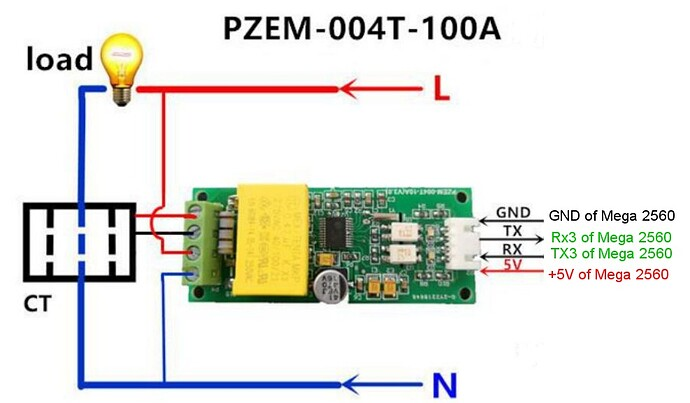
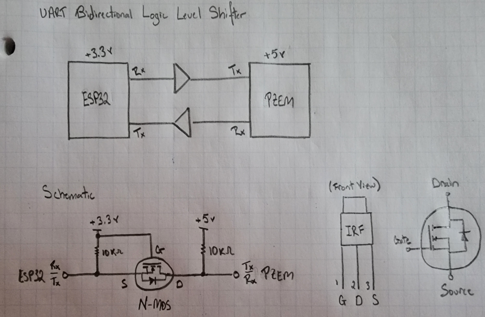
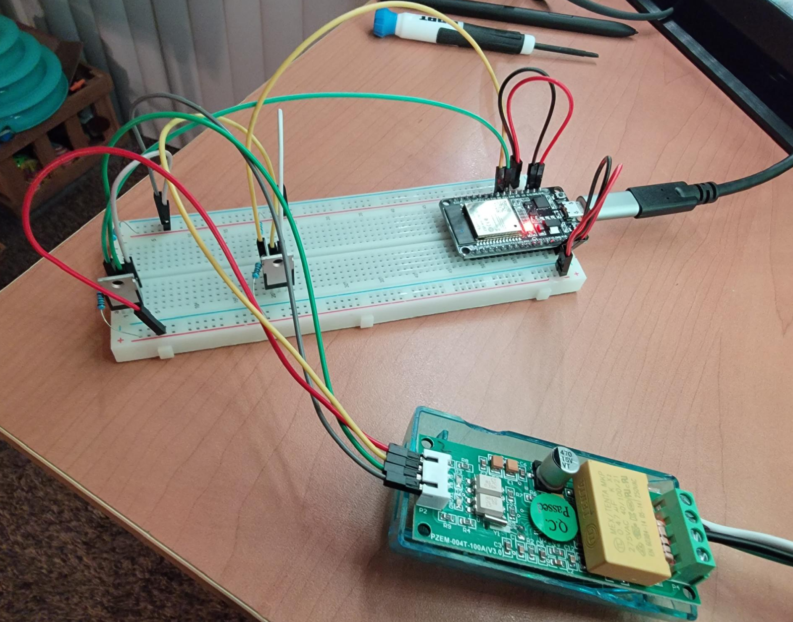
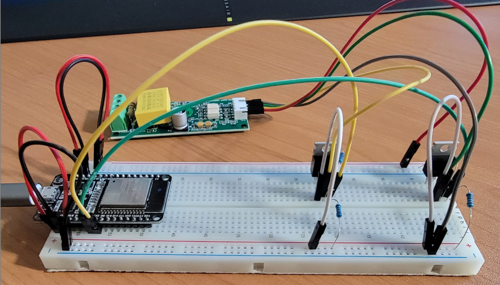

# PZEM-004T Power Monitoring Utility
[Specifications](#specifications)  
[Block Diagram](#block-diagram)  
[Wiring Instructions](#wiring-instructions)  
[PZEM Communication ID Modification](#pzem-communication-id-modification)  

## Specifications
| Measurement    | Range           | Accuracy | Resolution |
|----------------|-----------------|----------|------------|
| Voltage (AC)   | 80 - 260        | 0.5%     | 0.1 V      |
| Power Factor   | 0 - 1           | 1%       | 0.01       |
| Frequency (Hz) | 45 - 65         | 0.5%     | 0.1 Hz     |
| Current (A)    | 0 - 100 A       | 0.5%     | 0.001 A    |
| Real Power     | 0.4 W - 23 kW   | 0.5%     | 0.1 W      |
| Energy (kWh)   | 0 - 9999.99 kWh | 0.5 %    | 1 Wh       |

## Block Diagram

## Wiring Instructions
### Arduino Uno

- Pin 9  <-> PZEM RX
- Pin 10 <-> PZEM TX

### Arduino Mega

### ESP32
Unlike the Arduino, ESP32 microcontrollers operate primarily with a 3.3 VDC signal, posing a challenge to the 5 VDC UART signal used on the pzem. To mitigate this issue, a bidirectional UART logic level shifter can be used, which translates the esp32's 3.3 VDC communication signal to a 5 VDC signal on the pzem, and vise-versa. An n-channel mosfet enables bidirectional signals in the event this is needed. The general outline for such a circuit and wiring implementations are shown below.

## PZEM Communication ID Modification
Each pzem module has a default Modbus communication address of 0xF8 which it uses to receive and broadcast data. If multiple pzems are used on the same UART bus, this will lead to conflicts and issues processing data. To resolve this issue, the pzem's communication address can be changed.

A critical concern when changing the address is that no more than one pzem may be connected to the device modifying the address to achieve the desired configuration. Otherwise, each connected pzem will receive the updated address, and result in the same initial problem. To enforce the desired custom communication address, connect **one** pzem module to the connected microcontroller, and upload the code with the desired hexadecimal address. Make sure that each pzem's address is an increment of only 0x1 from the last so that the power monitoring routine can identify them sequentially.

[PZEM Custom Address Routine](modify-communication-address/src/main.cpp)
